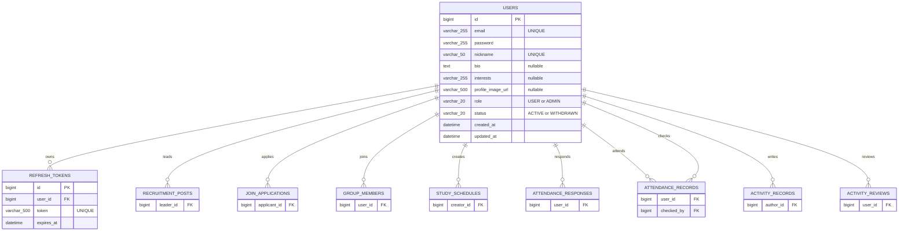

# Part1 회원·인증 ERD

## 범위

Part1이 소유하는 테이블은 `users`, `refresh_tokens`다. 아래 ERD는 제공된 MySQL 8.0 스키마를 기준으로 하며, 다른 파트의 테이블은 Part1과 직접 연결되는 FK 경계만 표시한다.

## Part1 테이블

### `users`

서비스 회원 계정과 프로필, 시스템 권한을 관리한다.

| 컬럼 | 타입 | 제약 및 설명 |
| --- | --- | --- |
| `id` | `BIGINT` | PK, AUTO_INCREMENT |
| `email` | `VARCHAR(255)` | 로그인 이메일, UNIQUE |
| `password` | `VARCHAR(255)` | BCrypt 등으로 암호화된 비밀번호 |
| `nickname` | `VARCHAR(50)` | 닉네임, UNIQUE |
| `bio` | `TEXT` | 자기소개, NULL 허용 |
| `interests` | `VARCHAR(255)` | 관심 분야, 콤마 구분 문자열로 시작 |
| `profile_image_url` | `VARCHAR(500)` | 프로필 이미지 URL, NULL 허용 |
| `role` | `VARCHAR(20)` | `USER`, `ADMIN`; 기본값 `USER` |
| `status` | `VARCHAR(20)` | `ACTIVE`, `WITHDRAWN`; 기본값 `ACTIVE` |
| `created_at` | `DATETIME` | 가입 시각, 기본값 `CURRENT_TIMESTAMP` |
| `updated_at` | `DATETIME` | 수정 시각, 기본값 `CURRENT_TIMESTAMP ON UPDATE CURRENT_TIMESTAMP` |

`role`은 시스템 권한이며 `group_members.role`처럼 스터디별 역할과 분리한다. 탈퇴는 물리 삭제보다 `WITHDRAWN` 상태 변경을 기본으로 한다.

### `refresh_tokens`

JWT refresh token을 저장해 access token 재발급과 로그아웃을 관리한다.

| 컬럼 | 타입 | 제약 및 설명 |
| --- | --- | --- |
| `id` | `BIGINT` | PK, AUTO_INCREMENT |
| `user_id` | `BIGINT` | `users.id` FK |
| `token` | `VARCHAR(500)` | refresh token 값, UNIQUE |
| `expires_at` | `DATETIME` | refresh token 만료 시각 |

회원 삭제 시 refresh token은 `ON DELETE CASCADE`로 함께 삭제된다. 현재 구현은 로그인 또는 재발급 시 사용자별 기존 refresh token을 삭제하고 새 token을 저장해 사용자당 활성 refresh token을 하나로 제한한다.

## 외부 테이블 경계

| 외부 테이블 | Part1 연결 | 관계 및 협업 기준 |
| --- | --- | --- |
| `recruitment_posts` | `leader_id` | Part2 모집글 작성자. Part1은 인증 사용자 식별자를 제공한다. |
| `join_applications` | `applicant_id` | Part2 가입 신청자. Part1은 회원 존재와 인증 사용자 식별자를 제공한다. |
| `group_members` | `user_id` | Part3 그룹 구성원. 그룹별 역할과 상태는 Part3가 관리한다. |
| `study_schedules` | `creator_id` | Part3 일정 등록자. 일정 권한은 Part3가 그룹원 역할로 판단한다. |
| `attendance_responses` | `user_id` | Part4 참석 응답자. |
| `attendance_records` | `user_id`, `checked_by` | Part4 출석 대상자와 체크 담당자. |
| `activity_records` | `author_id` | 활동 기록 작성자. |
| `activity_reviews` | `user_id` | 활동 회고 작성자. |

다른 파트는 Part1의 `Member` 엔티티나 repository에 직접 결합하기보다 JWT 인증 결과인 `AuthenticatedMember.id()` 또는 합의된 공개 서비스 경계를 사용한다.

## 삭제 및 갱신 규칙

| 관계 | `ON DELETE` | `ON UPDATE` | 의미 |
| --- | --- | --- | --- |
| 사용자 → refresh token | `CASCADE` | `CASCADE` | 회원 삭제 시 인증 토큰은 함께 삭제된다. |
| 사용자 → 모집글 | `RESTRICT` | `CASCADE` | 작성한 모집글이 있으면 사용자를 바로 삭제할 수 없다. |
| 사용자 → 가입 신청 | `RESTRICT` | `CASCADE` | 가입 신청 이력이 있으면 사용자를 바로 삭제할 수 없다. |
| 사용자 → 그룹원·일정·출석·활동 | `RESTRICT` | `CASCADE` | 다른 파트 데이터가 남아 있으면 사용자를 바로 삭제할 수 없다. |

따라서 회원 탈퇴 API를 구현할 때는 물리 삭제보다 `users.status = 'WITHDRAWN'` 상태 변경을 우선한다.

## 인덱스

| 테이블 | 인덱스 | 목적 |
| --- | --- | --- |
| `users` | UNIQUE (`email`) | 로그인 이메일 중복 방지와 로그인 조회 |
| `users` | UNIQUE (`nickname`) | 닉네임 중복 방지 |
| `refresh_tokens` | UNIQUE (`token`) | refresh token 단건 조회와 중복 방지 |
| `refresh_tokens` | (`user_id`) | 사용자별 token 삭제와 조회 |

## Entity 대응

| 테이블 | Entity | 관련 값 객체·Enum |
| --- | --- | --- |
| `users` | `member/entity/Member.java` | `MemberRole`, `MemberStatus` |
| `refresh_tokens` | `auth/entity/RefreshToken.java` | token 만료 검증 메서드 |

`Member`와 `RefreshToken`은 운영 MySQL 스키마와 맞도록 `IDENTITY`, 문자열 Enum, 컬럼 길이, UNIQUE 제약을 반영한다. `RefreshToken.userId`는 Part1 내부 사용자 FK지만 token 관리 유스케이스가 회원의 전체 프로필 데이터를 직접 변경하지 않도록 식별자 값으로 매핑한다.