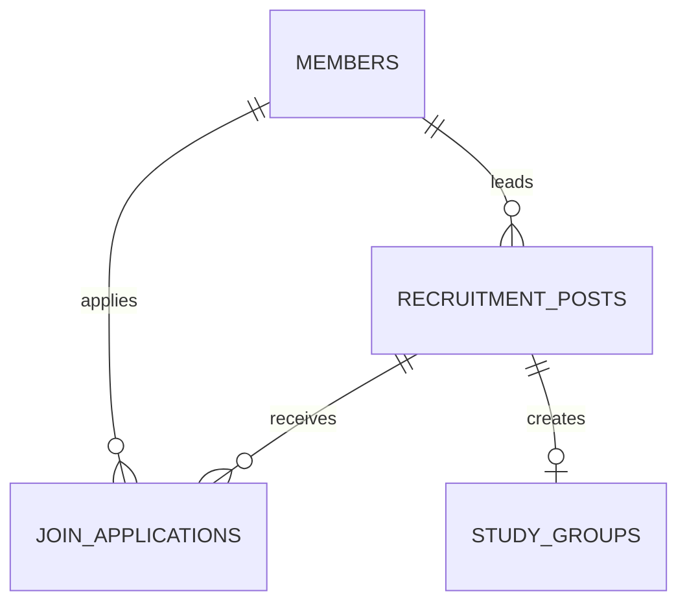

# Part2 모집글·지원 ERD

## 범위

Part2는 `recruitment_posts`, `join_applications`를 소유한다. 외부 테이블은 FK 경계만 다룬다.

## 테이블

### `recruitment_posts`

| 컬럼 | 타입 | 제약 |
| --- | --- | --- |
| `id` | `BIGINT` | PK, AUTO_INCREMENT |
| `leader_id` | `BIGINT` | `members.id` FK |
| `title` | `VARCHAR(100)` | 필수(길이 제약 실제 적용 확인 필요) |
| `category` | `VARCHAR(50)` | 필수 |
| `description` | `TEXT` | NULL 허용 |
| `goal` | `VARCHAR(255)` | NULL 허용 |
| `method` | `VARCHAR(255)` | NULL 허용 |
| `meeting_type` | `VARCHAR(20)` | 문자열 컬럼(Enum 아님). 예: `ONLINE`, `OFFLINE` |
| `location` | `VARCHAR(255)` | NULL 허용 |
| `online_link` | `VARCHAR(500)` | NULL 허용 |
| `meeting_day` | `VARCHAR(50)` | NULL 허용 |
| `capacity` | `INT` | NULL 허용(현재 nullable — 응답 DTO는 원시 `int`라 NPE 위험, "확인 필요" 참고) |
| `recruitment_deadline` | `DATE` | NULL 허용 |
| `expected_duration` | `VARCHAR(50)` | NULL 허용 |
| `conditions` | `TEXT` | NULL 허용 |
| `status` | `VARCHAR(20)` | 문자열 컬럼(Enum 아님). `RECRUITING`, `CLOSED`, `ACTIVE`, `ENDED` |
| `created_at` | `DATETIME` | `@CreationTimestamp`, 엔티티에 직접 매핑(공용 `BaseTimeEntity` 미사용) |
| `updated_at` | `DATETIME` | `@UpdateTimestamp`, 엔티티에 직접 매핑 |

### `join_applications`

| 컬럼 | 타입 | 제약 |
| --- | --- | --- |
| `id` | `BIGINT` | PK, AUTO_INCREMENT |
| `post_id` | `BIGINT` | `recruitment_posts.id` FK |
| `applicant_id` | `BIGINT` | `members.id` FK |
| `motivation` | `TEXT` | 필수 |
| `experience` | `TEXT` | NULL 허용 |
| `available_time` | `VARCHAR(255)` | NULL 허용 |
| `desired_role` | `VARCHAR(50)` | NULL 허용 |
| `status` | `VARCHAR(20)` | `PENDING`, `APPROVED`, `REJECTED`; 기본 `PENDING` |
| `applied_at` | `DATETIME` | 기본 `CURRENT_TIMESTAMP` |

`(post_id, applicant_id)`가 같은 모집글에 대한 사용자 중복 지원을 막아야 한다(현재 `existsByPostIdAndApplicantId` 애플리케이션 레벨 체크만 확인됨 — DB UNIQUE 제약 존재 여부 확인 필요).

## 외부 경계와 삭제 정책

| 관계 | 삭제 | 갱신 | 책임 |
| --- | --- | --- | --- |
| 회원 → 모집글(리더) | `RESTRICT` | `CASCADE` | Part2는 회원 ID만 참조 |
| 회원 → 지원서(지원자) | `RESTRICT` | `CASCADE` | Part2는 회원 ID만 참조 |
| 모집글 → 지원서 | `CASCADE`(추정, 확인 필요) | `CASCADE` | 모집글 종속 관계 |
| 모집글 → 그룹 | `RESTRICT`(Part3 소유 FK) | `CASCADE` | Part2가 생성 조건을 판단해 `StudyGroupProvisioningPort` 호출, 실제 FK는 `study_groups.post_id`에 걸림 |

모집글 삭제 시 `study_groups.post_id` FK가 `RESTRICT`이므로, 현재 설계(모집글 작성 즉시 그룹 자동 생성)에서는 그룹이 없는 모집글이 사실상 없어 삭제가 항상 FK 위반으로 막힐 수 있다. 이 경우를 어떻게 처리할지는 `feature-spec.md`의 "모집글 삭제" 절과 `study-group-integration-design.md`를 참고한다.

## 인덱스

| 테이블 | 인덱스 | 목적 |
| --- | --- | --- |
| `recruitment_posts` | (`category`) | 카테고리별 목록 조회 |
| `recruitment_posts` | (`leader_id`) | 리더별 조회 |
| `join_applications` | (`post_id`) | 모집글별 지원자 목록 조회 |
| `join_applications` | (`applicant_id`, `status`) | 내 신청 목록 상태별 조회 |
| `join_applications` | UNIQUE(`post_id`, `applicant_id`) | 중복 지원 방지(DB 레벨 적용 여부 확인 필요) |

## Entity 매핑

- `RecruitmentPost.leader`는 `Member`를 지연 로딩 `ManyToOne`으로 직접 매핑한다(Part3와 달리 Part1 `Member` Entity를 직접 참조 — 구조 통일 여부는 팀 논의 필요).
- `JoinApplication.post`는 `RecruitmentPost`를, `JoinApplication.applicant`는 `Member`를 지연 로딩 `ManyToOne`으로 매핑한다.
- 그룹(`study_groups`)과의 연관은 Entity 레벨 매핑이 아니라 `postId`를 통한 `StudyGroupProvisioningPort` 호출로만 연결한다. Part2는 Part3의 `StudyGroup`/`GroupMember` Entity나 Repository를 직접 참조하지 않는다.
- 공개 setter 없이 `close()`, `activate()`, `end()`, `update()` 등 의미 있는 상태 변경 메서드를 사용한다.
