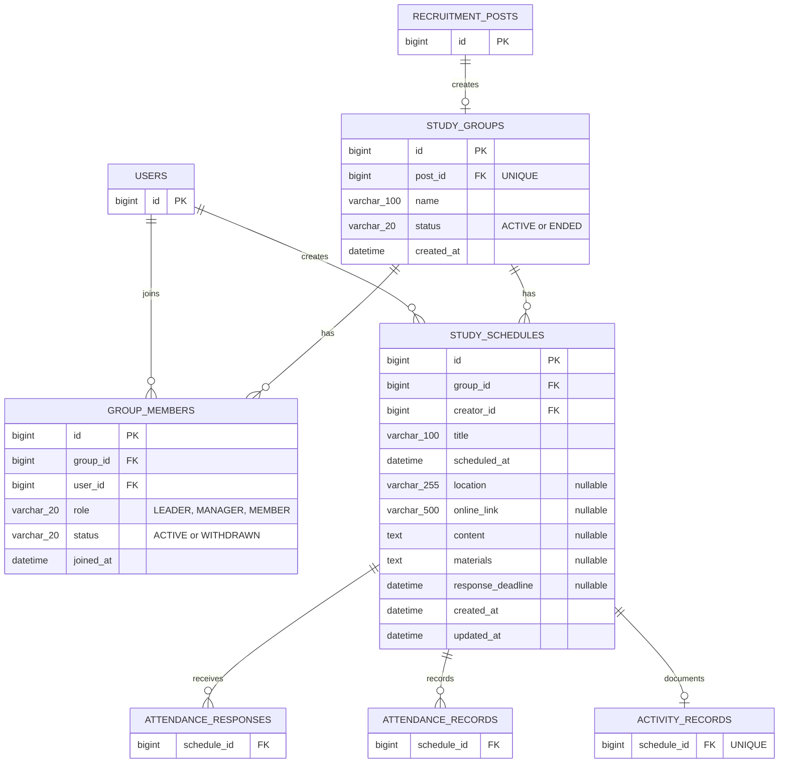

# Part3 그룹·일정 ERD

## 범위

Part3가 소유하는 테이블은 `study_groups`, `group_members`, `study_schedules`다. 아래 ERD는 제공된 MySQL 8.0 스키마를 기준으로 하며, 다른 파트의 테이블은 Part3와 직접 연결되는 FK 경계만 표시한다.

## Part3 테이블

### `study_groups`

모집이 완료된 모집글과 1:1로 연결되는 스터디 그룹이다.

| 컬럼 | 타입 | 제약 및 설명 |
| --- | --- | --- |
| `id` | `BIGINT` | PK, AUTO_INCREMENT |
| `post_id` | `BIGINT` | `recruitment_posts.id` FK, UNIQUE |
| `name` | `VARCHAR(100)` | 그룹명, 일반적으로 모집글 제목을 승계 |
| `status` | `VARCHAR(20)` | `ACTIVE`, `ENDED`; 기본값 `ACTIVE` |
| `created_at` | `DATETIME` | 생성 시각, 기본값 `CURRENT_TIMESTAMP` |

`post_id` 유니크 제약으로 모집글 하나에서 그룹이 중복 생성되는 것을 차단한다.

### `group_members`

스터디 그룹과 사용자의 소속, 역할 및 활동 상태를 관리한다.

| 컬럼 | 타입 | 제약 및 설명 |
| --- | --- | --- |
| `id` | `BIGINT` | PK, AUTO_INCREMENT |
| `group_id` | `BIGINT` | `study_groups.id` FK |
| `user_id` | `BIGINT` | `users.id` FK |
| `role` | `VARCHAR(20)` | `LEADER`, `MANAGER`, `MEMBER`; 기본값 `MEMBER` |
| `status` | `VARCHAR(20)` | `ACTIVE`, `WITHDRAWN`; 기본값 `ACTIVE` |
| `joined_at` | `DATETIME` | 가입 시각, 기본값 `CURRENT_TIMESTAMP` |

`(group_id, user_id)` 복합 유니크 제약으로 동일 사용자의 그룹 중복 가입을 차단한다. `MANAGER`는 일정 등록 권한을 위임받은 그룹원이다.

### `study_schedules`

그룹에 속한 일정을 관리한다.

| 컬럼 | 타입 | 제약 및 설명 |
| --- | --- | --- |
| `id` | `BIGINT` | PK, AUTO_INCREMENT |
| `group_id` | `BIGINT` | `study_groups.id` FK |
| `creator_id` | `BIGINT` | `users.id` FK, 일정 등록자 |
| `title` | `VARCHAR(100)` | 일정 제목 |
| `scheduled_at` | `DATETIME` | 일정 날짜와 시간 |
| `location` | `VARCHAR(255)` | 오프라인 장소, NULL 허용 |
| `online_link` | `VARCHAR(500)` | 온라인 링크, NULL 허용 |
| `content` | `TEXT` | 일정 내용, NULL 허용 |
| `materials` | `TEXT` | 준비물, NULL 허용 |
| `response_deadline` | `DATETIME` | 참석 응답 마감 시각, NULL 허용 |
| `created_at` | `DATETIME` | 생성 시각 |
| `updated_at` | `DATETIME` | 수정 시각 |

`response_deadline`은 NULL이거나 `scheduled_at`보다 같거나 이른 값이어야 한다. 일정 생성 API는
두 시각을 모두 생성 시점보다 미래로 제한하되, 이 규칙은 현재 시각에 의존하므로 데이터베이스가
아닌 서비스에서 검증한다.

`location`과 `online_link`는 모두 NULL을 허용한다. 둘 다 NULL이면 장소 미정, 하나만 있으면
오프라인 또는 온라인 일정, 둘 다 있으면 온·오프라인 병행 일정으로 해석한다. `online_link`는
컬럼명을 유지하지만 URL만 강제하지 않고 Discord 채널명이나 Zoom 회의 ID를 포함한 온라인
접속 정보를 최대 500자의 일반 문자열로 저장한다. 공백 문자열은 API 경계에서 NULL로
정규화한다.

## 외부 테이블 경계

| 외부 테이블 | Part3 연결 | 관계 및 협업 기준 |
| --- | --- | --- |
| `recruitment_posts` | `study_groups.post_id` | Part2가 정원 마감 또는 최초 승인 조건을 판단하고 Part3에 그룹 생성을 요청한다. |
| `users` | `group_members.user_id`, `study_schedules.creator_id` | Part3는 사용자 식별자만 참조하며 사용자 계정 데이터는 수정하지 않는다. |
| `attendance_responses` | `schedule_id` | Part4가 일정별 참석 응답을 관리한다. |
| `attendance_records` | `schedule_id` | Part4가 일정별 출석 결과를 관리한다. |
| `activity_records` | `schedule_id` | Part3 외부 담당 영역이 일정별 활동 기록을 관리한다. 일정 하나당 활동 기록은 최대 하나다. |

## 삭제 및 갱신 규칙

| 관계 | `ON DELETE` | `ON UPDATE` | 의미 |
| --- | --- | --- | --- |
| 모집글 → 그룹 | `RESTRICT` | `CASCADE` | 연결된 그룹이 있으면 모집글을 바로 삭제할 수 없다. |
| 그룹 → 그룹원 | `CASCADE` | `CASCADE` | 그룹 삭제 시 그룹원 관계도 삭제된다. |
| 사용자 → 그룹원 | `RESTRICT` | `CASCADE` | 그룹원 관계가 남아 있으면 사용자를 바로 삭제할 수 없다. |
| 그룹 → 일정 | `CASCADE` | `CASCADE` | 그룹 삭제 시 일정도 삭제된다. |
| 사용자 → 일정 등록자 | `RESTRICT` | `CASCADE` | 등록한 일정이 남아 있으면 사용자를 바로 삭제할 수 없다. |
| 일정 → 출석·활동 데이터 | `CASCADE` | `CASCADE` | 일정 삭제 시 다른 파트의 연결 데이터도 함께 삭제된다. |

그룹 또는 일정 삭제 API는 위 연쇄 삭제가 다른 파트의 데이터에 미치는 영향을 확인하고 담당자와 정책을 합의한 뒤 구현한다.

## 인덱스

| 테이블 | 인덱스 | 목적 |
| --- | --- | --- |
| `study_groups` | UNIQUE (`post_id`) | 모집글별 그룹 단건 조회 및 중복 생성 방지 |
| `group_members` | UNIQUE (`group_id`, `user_id`) | 그룹 내 사용자 중복 방지 |
| `group_members` | (`user_id`, `status`) | 사용자의 활성·탈퇴 그룹 조회 |
| `study_schedules` | (`group_id`, `scheduled_at`) | 그룹별 일정 시간순 조회 |
| `study_schedules` | (`creator_id`) | 등록자별 일정 조회 |

## Entity 대응

| 테이블 | Entity | 관련 값 객체·Enum |
| --- | --- | --- |
| `study_groups` | `study/entity/StudyGroup.java` | `GroupStatus` |
| `group_members` | `study/entity/GroupMember.java` | `GroupRole`, `GroupMemberStatus` |
| `study_schedules` | `schedule/entity/StudySchedule.java` | 일정 생성·수정 DTO |

`StudyGroup`과 `GroupMember`의 JPA 매핑은 구현되었다. Part3 외부 경계를 유지하기 위해
`StudyGroup.postId`와 `GroupMember.userId`는 외부 도메인 Entity 연관관계가 아닌 식별자 값으로
매핑하고, Part3가 소유하는 `GroupMember.studyGroup`만 지연 로딩 연관관계로 매핑한다. 외부
FK는 운영 데이터베이스 스키마가 보장하며, 외부 식별자의 존재 여부는 이후 합의된 공개 서비스
경계에서 검증한다.

`StudySchedule`은 아직 빈 스켈레톤이다. 실제 JPA 매핑을 구현할 때 이 문서와 SQL의 컬럼 길이,
NULL 허용 여부, 유니크·CHECK·FK 제약을 함께 반영한다.
