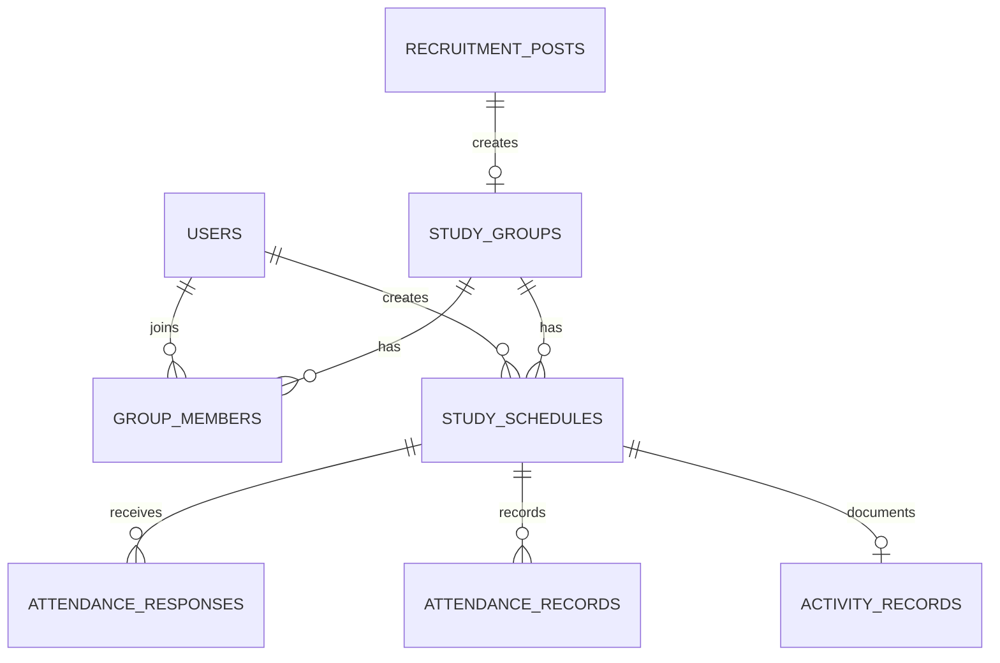

# Part3 그룹·일정 ERD

## 범위

Part3는 `study_groups`, `group_members`, `study_schedules`를 소유한다. 외부 테이블은 FK 경계만 다룬다.

## 테이블

### `study_groups`

| 컬럼 | 타입 | 제약 |
| --- | --- | --- |
| `id` | `BIGINT` | PK, AUTO_INCREMENT |
| `post_id` | `BIGINT` | `recruitment_posts.id` FK, UNIQUE |
| `name` | `VARCHAR(100)` | 필수 |
| `status` | `VARCHAR(20)` | `ACTIVE`, `ENDED`; 기본 `ACTIVE` |
| `created_at` | `DATETIME` | 기본 `CURRENT_TIMESTAMP` |

`post_id`가 모집글당 그룹 하나를 보장한다.

### `group_members`

| 컬럼 | 타입 | 제약 |
| --- | --- | --- |
| `id` | `BIGINT` | PK, AUTO_INCREMENT |
| `group_id` | `BIGINT` | `study_groups.id` FK |
| `user_id` | `BIGINT` | `users.id` FK |
| `role` | `VARCHAR(20)` | `LEADER`, `MANAGER`, `MEMBER`; 기본 `MEMBER` |
| `status` | `VARCHAR(20)` | `ACTIVE`, `WITHDRAWN`; 기본 `ACTIVE` |
| `joined_at` | `DATETIME` | 기본 `CURRENT_TIMESTAMP` |

`(group_id, user_id)`가 같은 그룹의 사용자 중복을 막는다.

### `study_schedules`

| 컬럼 | 타입 | 제약 |
| --- | --- | --- |
| `id` | `BIGINT` | PK, AUTO_INCREMENT |
| `group_id` | `BIGINT` | `study_groups.id` FK |
| `creator_id` | `BIGINT` | `users.id` FK |
| `title` | `VARCHAR(100)` | 필수 |
| `scheduled_at` | `DATETIME` | 필수 |
| `location` | `VARCHAR(255)` | NULL 허용 |
| `online_link` | `VARCHAR(500)` | NULL 허용 |
| `content`, `materials` | `TEXT` | NULL 허용 |
| `response_deadline` | `DATETIME` | NULL 또는 `scheduled_at` 이하 |
| `created_at`, `updated_at` | `DATETIME` | 필수 |

현재 시각과 비교하는 생성·변경 규칙은 DB가 아니라 Service가 검증한다. 선택 문자열은 API 경계에서 공백을 제거하고 빈 값을 `null`로 바꾼다. `online_link`는 URL 외 온라인 접속 정보도 허용한다.

## 외부 경계와 삭제 정책

| 관계 | 삭제 | 갱신 | 책임 |
| --- | --- | --- | --- |
| 모집글 → 그룹 | `RESTRICT` | `CASCADE` | Part2가 생성 조건을 판단하고 Part3를 호출 |
| 그룹 → 그룹원 | `CASCADE` | `CASCADE` | 그룹 종속 관계 |
| 사용자 → 그룹원 | `RESTRICT` | `CASCADE` | Part3는 사용자 ID만 참조 |
| 그룹 → 일정 | `CASCADE` | `CASCADE` | 그룹 종속 관계 |
| 사용자 → 일정 | `RESTRICT` | `CASCADE` | Part3는 등록자 ID만 참조 |
| 일정 → 참석 응답 | `CASCADE` | `CASCADE` | 미래 일정 삭제 시 임시 응답 제거 |
| 일정 → 출석 기록 | `RESTRICT` | `CASCADE` | 출석 이력 보존 |
| 일정 → 활동 기록 | `RESTRICT` | `CASCADE` | 활동 이력 보존 |

Part3는 외부 Entity·Repository에 직접 결합하지 않는다. 미래 일정 삭제 전 출석·활동 기록을 공개 조회 포트로 확인하고, FK가 동시 요청을 포함한 최종 무결성을 보장한다.

## 인덱스

| 테이블 | 인덱스 | 목적 |
| --- | --- | --- |
| `study_groups` | UNIQUE (`post_id`) | 멱등 그룹 생성 |
| `group_members` | UNIQUE (`group_id`, `user_id`) | 그룹원 중복 방지 |
| `group_members` | (`user_id`, `status`) | 사용자별 그룹 조회 |
| `study_schedules` | (`group_id`, `scheduled_at`) | 그룹별 시간 범위 조회 |
| `study_schedules` | (`creator_id`) | 등록자별 조회 |

## Entity 매핑

- `StudyGroup.postId`, `GroupMember.userId`, `StudySchedule.creatorId`는 외부 Entity가 아닌 `Long` 식별자다.
- Part3 내부 `GroupMember.studyGroup`, `StudySchedule.studyGroup`만 지연 로딩 연관관계로 매핑한다.
- 공개 setter 없이 생성·상태 변경 메서드를 사용한다.
